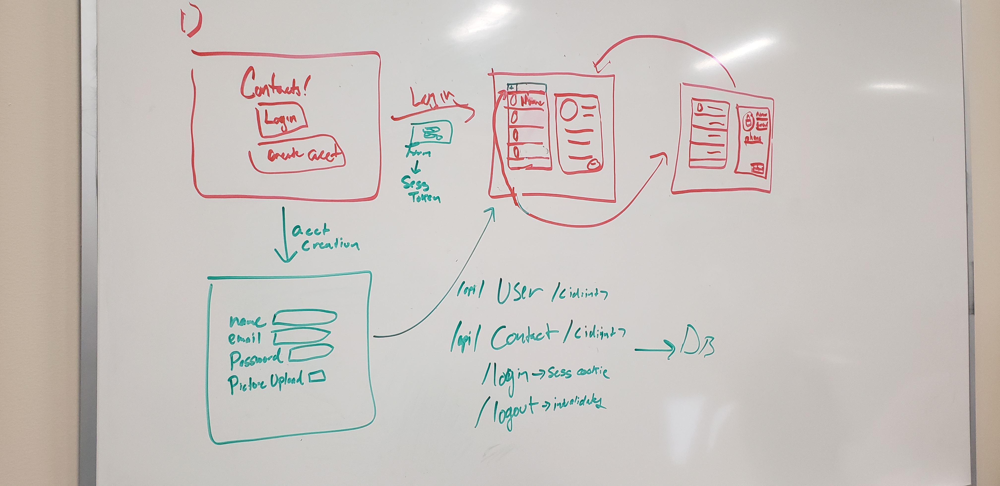

# Contact Manager

Contact Manager Project that does Cool Stuffs

## Diagram

## Database

MySQL running on the Ubuntu host in AWS

### Prerequisite installations

- [Docker for OSX](https://docs.docker.com/docker-for-mac) or [Docker for Linux](https://runnable.com/docker/install-docker-on-linux)
- [MySQL Workbench](https://www.mysql.com/products/workbench/)
- [Docker Compose](https://docs.docker.com/compose/install/)

For local development, I have added a `docker-compose.yml` file as well as a `Makefile`.

In order to spin up the database, run `make docker-run` and it will build the container. You can then login to the database with any MySQL client, such as [MySQL Workbench](https://www.mysql.com/products/workbench/). The address will be `127.0.0.1` and the credentials will be `root:cf03a9bd7c7a7310ba15fe02eceb87ee04e7d40f89a5bea14a07bf56a2f42231` in this case.

## Backend

Flask RESTful API

## Frontend
